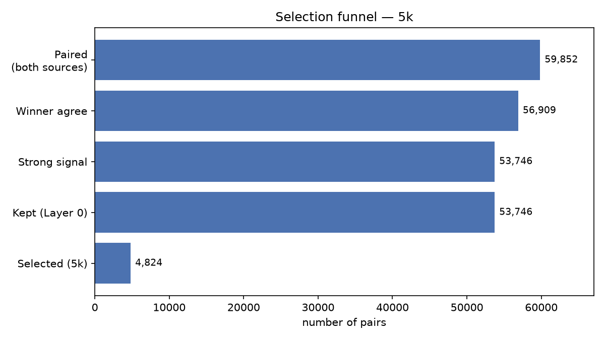
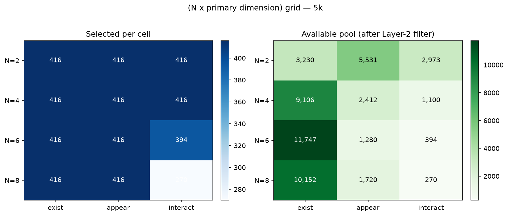
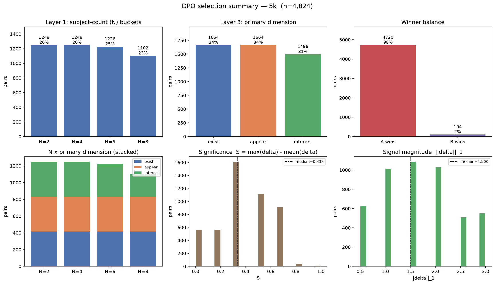

# DPO selection report — 5k

## Selection funnel

| stage | pairs | kept % |
|---|---:|---:|
| paired (both sources) | 59,852 | 100.0% |
| winner agree | 56,909 | 95.1% |
| strong signal | 53,746 | 89.8% |
| kept after Layer 0 | 53,746 | 89.8% |
| selected (5k) | 4,824 | 8.1% |

- dropped — winner disagree: **2,943**, weak signal (‖δ‖≈0): **3,163**, missing N: **0**

## Layer 1 — subject-count (N) buckets

| N | selected | share |
|---:|---:|---:|
| 2 | 1248 | 25.9% |
| 4 | 1248 | 25.9% |
| 6 | 1226 | 25.4% |
| 8 | 1102 | 22.8% |

## Layer 3 — primary dimension

| dimension | selected | share |
|---|---:|---:|
| existence | 1664 | 34.5% |
| appearance | 1664 | 34.5% |
| interaction | 1496 | 31.0% |

## (N x primary dimension) grid — selected / pool after filter

| N | existence | appearance | interaction | row total |
|---:|---:|---:|---:|---:|
| 2 | 416 / 3230 | 416 / 5531 | 416 / 2973 | 1248 |
| 4 | 416 / 9106 | 416 / 2412 | 416 / 1100 | 1248 |
| 6 | 416 / 11747 | 416 / 1280 | 394 / 394 ⚠ | 1226 |
| 8 | 416 / 10152 | 416 / 1720 | 270 / 270 ⚠ | 1102 |

- per-cell target = **416**; ⚠ marks cells that fell back to taking the full pool (scarce stratum).

## Winner balance

- A wins: **4720** (97.8%)  
- B wins: **104** (2.2%)

## Signal statistics (selected set)

| metric | mean | median | min | max |
|---|---:|---:|---:|---:|
| significance S | 0.383 | 0.333 | 0.000 | 1.000 |
| ‖δ‖₁ | 1.649 | 1.500 | 0.500 | 3.000 |

## Figures

- 
- 
- 
